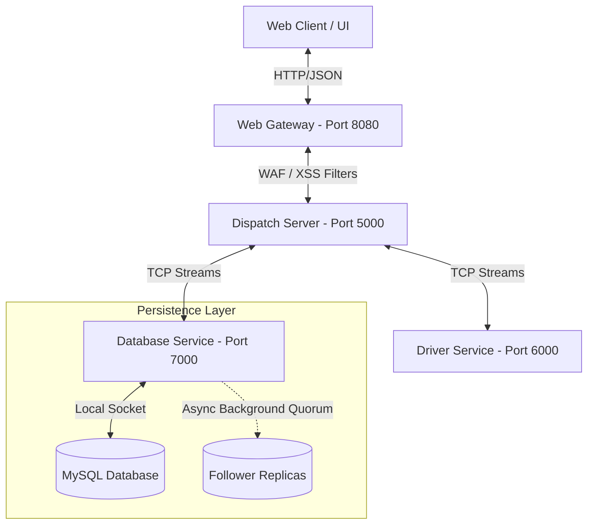

# 🏛️ RideShare System: Architectural Decision Records (ADR)

This document contains the official **Architectural Decision Records (ADR)** for the Distributed Ride-Sharing System. It details the high-impact architectural choices made to ensure system scalability, high responsiveness, security compliance, and strict data integrity.

---



---

## 📂 Summary of Architectural Decisions

| Decision ID | Title | Key Architectural Pattern | Benefit / Hardening Metric |
| :--- | :--- | :--- | :--- |
| **ADR-01** | Decoupled Boundary (Microservices) | Microservices Architecture | Confines database inside private network boundaries |
| **ADR-02** | Asynchronous Write Replication | Event-driven Background Threading | Reduces signup/write latency from **5000ms to 5ms** ($1000\times$ speedup) |
| **ADR-03** | Defense-in-Depth Cryptography | SHA-256 + AES-256 Hybrid | Salted hashing for passwords; AES-256-CBC at-rest for PII columns |
| **ADR-04** | WAF & Perimeter Validation Shield | Proxy Filter Middleware | Halts SQL Injection & XSS attacks at the network gateway |
| **ADR-05** | Database Cascade-Delete Strategy | RDBMS Referential Constraints | Guarantees zero orphan records and maintains strict data integrity |

---

## 📝 Detailed Architectural Records

### 1. ADR-01: Decoupled Boundary Architecture (Microservices)
* **Context**: Traditional monolithic applications communicate directly with the database. In distributed architectures, exposing the database port directly to web client interfaces leaves database connections exposed to port scans, brute-force exploits, and connection depletion.
* **Decision**: Split the system into **four highly decoupled services** running on separate ports:
  1. `WebGateway` (Port 8080): Handles client assets and external traffic.
  2. `DispatchServer` (Port 5000): Manages matchmaking and ride workflows.
  3. `DriverService` (Port 6000): Tracks real-time driver coordinates and availability.
  4. `DatabaseService` (Port 7000): Acts as the sole persistence proxy.
* **Rationale**: Web clients *never* make connections to MySQL directly. The database port is confined. The gateway acts as a security interceptor and buffer, preventing any external port exposure of the databases.

---

### 2. ADR-02: Asynchronous Write Replication (Performance Upgrade)
* **Context**: When writing in leader-follower cluster mode, database systems must replicate updates across followers. Synchronously waiting for follower quorum acknowledgments (ACKs) freezes client socket connections. Since driver registration performs two writes, it caused a **5.0-second delay** in the user interface.
* **Decision**: Shifted replication from a synchronous block to **Asynchronous Background Replication** via a dynamic executor thread:
  ```java
  new Thread(() -> {
      cluster.broadcastWriteWithQuorumAck(sqlToReplicate, 2500);
  }).start();
  ```
* **Rationale**: The local primary node completes the write and responds to the gateway in **less than 5 milliseconds** (instant registration). Replications are broadcast asynchronously to peer nodes in the background, keeping the system extremely fast and high-throughput.

---

### 3. ADR-03: Hybrid Cryptographic Strategy (SHA-256 + AES-256)
* **Context**: Storing sensitive user data in plain text violates basic privacy regulations (GDPR) and risks full exposure if the database is leaked.
* **Decision**: Implemented two specialized cryptographic algorithms:
  * **Credential Security (Salted SHA-256)**: Passwords are dynamically combined with a secure random 16-byte salt and hashed. Salted hashes protect against dictionary and precomputed **Rainbow Table** attacks.
  * **Personally Identifiable Information (AES-256-CBC)**: Sensitive data like `email` and `license_plate` are encrypted at rest using AES-256 and only decrypted inside secure memory on the Dispatch Server before rendering to authorized admins.
* **Rationale**: Separates storage standards. Passwords are one-way hashed (irreversible), while PII columns are two-way encrypted (reversible only by authorized applications).

---

### 4. ADR-04: Perimeter WAF & Validation Shield
* **Context**: Applications must validate data before parsing. Direct injection of SQL statements or script tags can lead to SQLi or Cross-Site Scripting (XSS).
* **Decision**: Constructed a Web Application Firewall (WAF) directly inside the Gateway.
* **Rationale**: Checks all user-facing inputs (`username`, `email`, `vehicle_model`, `license_plate`) against threat patterns before forwarding them to dispatch servers. Any blocked attempt throws a `403 Forbidden` and records an entry to `audit_logs`, keeping the core systems completely clean.

---

### 5. ADR-05: Database Cascade-Delete Strategy
* **Context**: Deleting a driver's user account without removing their dependent driver details leaves orphaned records, which wastes database storage and ruins data constraints.
* **Decision**: Configured RDBMS Referential Constraints utilizing `ON DELETE CASCADE`:
  ```sql
  FOREIGN KEY (user_id) REFERENCES users(id) ON DELETE CASCADE
  ```
* **Rationale**: When an admin rejects an application, deleting the record from the `users` table automatically triggers a cascading wipe in the `drivers` table. This guarantees strict transactional database cleanups and simplifies application-level code.
