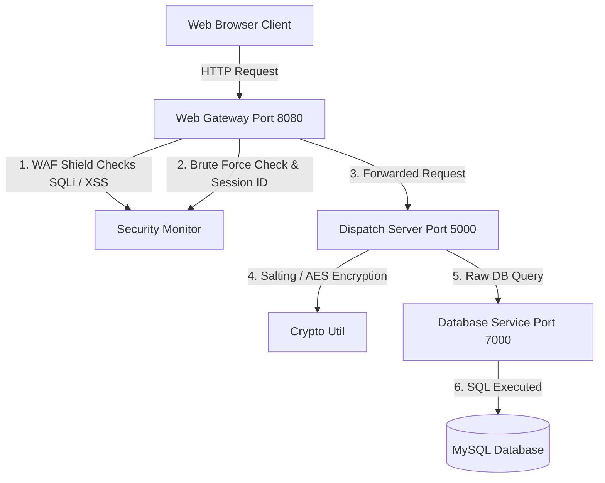

# 🛡️ RideShare System: Cryptography & Security Architecture Report

This report outlines the **Multilayered Defense Architecture** engineered inside the Distributed Ride-Sharing System. The application implements standard defensive principles including a custom **Web Application Firewall (WAF)**, an **Intrusion Detection System (IDS)**, database-level encryption, dynamic rate-limiting, and detailed cryptographic operations.

---

## 🧭 Multi-Tier Security Flow
The system operates on a decoupled microservices boundary. Web clients never communicate directly with backend database nodes. Instead, every data payload flows through a structured, highly secure pipeline:



---

## 🔑 1. Cryptographic Controls (`CryptoUtil.java`)

To protect user confidentiality and comply with modern data privacy policies, the application utilizes advanced cryptographic algorithms via a secure utility package.

### A. Salted Password Hashing (SHA-256)
Plaintext passwords are never stored in the database. When a user registers:
1. The system generates a cryptographically secure 128-bit random salt using `java.security.SecureRandom`.
2. The salt is appended to the plaintext password.
3. The concatenated string is hashed using `SHA-256`.
4. **Database Storage Format**: The database stores the unique salt and hash separated by a colon (`salt:hash`), e.g.:
   `e1f82c2b3e4f...:c5a3d7e8f9a0b1...`

```java
public static String hashPassword(String password, String salt) {
    if (password == null) return null;
    try {
        MessageDigest digest = MessageDigest.getInstance("SHA-256");
        String combined = password + salt;
        byte[] hash = digest.digest(combined.getBytes(StandardCharsets.UTF_8));
        return bytesToHex(hash);
    } catch (Exception e) {
        return password; 
    }
}
```
* **Benefit**: Protects against precomputed **Rainbow Table** and dictionary attacks. Even if two users share the same password, their stored hashes are entirely unique due to the distinct salts.

### B. Reversible Column-Level Encryption (AES-256-CBC)
To protect **Personally Identifiable Information (PII)** at rest, sensitive columns are encrypted in the database using symmetric encryption:
* **Target Columns**: `email` (in the `users` table) and `license_plate` (in the `drivers` table).
* **Algorithm**: **AES-256** in Cipher Block Chaining (**CBC**) mode with **PKCS5Padding**.
* **Key & IV Derivation**: The 256-bit AES key is derived from a key seed (`RideShareSecureKey2026EnterpriseShield!`) using `SHA-256`. The 16-byte initialization vector (IV) is derived from the first 16 bytes of that key digest.
* **Storage Prefix**: Encrypted strings are marked in the database with the prefix `AES256:`, e.g.:
   `AES256:i2WqXj7qLd8s2c1...`

```java
public static String encryptAES(String plainText) {
    if (plainText == null || plainText.isEmpty()) return plainText;
    try {
        Cipher cipher = Cipher.getInstance("AES/CBC/PKCS5Padding");
        cipher.init(Cipher.ENCRYPT_MODE, secretKeySpec, ivParameterSpec);
        byte[] encryptedBytes = cipher.doFinal(plainText.getBytes(StandardCharsets.UTF_8));
        return "AES256:" + Base64.getEncoder().encodeToString(encryptedBytes);
    } catch (Exception e) {
        return plainText; 
    }
}
```
* **Decryption Policy**: Encrypted PII columns are only decrypted in memory at the `DispatchServer` layer upon serving data to verified sessions (such as the Administrator panel dashboard).

---

## 🛡️ 2. Edge Defensive Controls: WAF & IDS (`SecurityMonitor.java`)

A custom gateway-level shield blocks web attacks before they reach backend logic.

### A. SQL Injection (SQLi) Prevention Shield
Incoming request strings are parsed and evaluated against standard SQLi signature patterns:
* `UNION\s+SELECT`
* `SELECT\s+.*\s+FROM`
* `INSERT\s+INTO`
* `DROP\s+TABLE`
* `' OR '1'='1` or other tautologies.
* `--`, `#`, or `/*` comment patterns.

If an attack signature matches, the gateway:
1. Immediately aborts processing.
2. Returns an HTTP `403 Forbidden` with the error `WAF Shield Alert: Malicious SQL injection payload blocked.`.
3. Calls the Intrusion Detection System to log the incident in the database.

### B. Cross-Site Scripting (XSS) Prevention Shield
Scans payload fields for scripting vectors, including:
* `<script>` blocks
* `javascript:` protocol URI injection
* Interactive HTML event listeners (e.g., `onload=`, `onerror=`, `onclick=`)
* `<iframe>` elements

Blocks register/login flows immediately if an XSS attempt is detected.

### C. Intrusion Detection System Logging
Security events are recorded directly into the `audit_logs` MySQL database table using the gateway client to ensure audit trails:
```java
public static void logSecurityEvent(NetworkClient dbClient, String eventType, String details) {
    System.err.println("[SECURITY-IDS] Alert! Type: " + eventType + " | Details: " + details);
    if (dbClient == null) return;
    try {
        String safeDetails = escapeSql(details); // Custom double single-quote replacement to prevent log injection
        String sql = String.format("INSERT INTO audit_logs (event_type, details) VALUES ('%s', '%s')", 
            eventType, safeDetails);
        dbClient.send(new JSONObject().put("type", "DB_UPDATE").put("sql", sql));
        dbClient.receive();
    } catch (Exception e) {
        System.err.println("[SECURITY-IDS] Failed to write log: " + e.getMessage());
    }
}
```

---

## 🔒 3. Authentication & Account Protection

### A. Session Tokenization
* **Secure Tokens**: Session authentication relies on random UUID strings (`UUID.randomUUID().toString()`) generated in the Gateway.
* **Access Control Check**: Valid clients must include the header `X-Session-ID` on standard request handlers (`/api/request`, `/api/send`, `/api/updates`). If the Session ID is missing or invalid, the request is rejected with `403 Forbidden`.

### B. Dynamic Brute-Force Lockout
To thwart credential stuffing or login dictionary attacks:
1. The system tracks failed attempts by username in a thread-safe `ConcurrentHashMap`.
2. A user is allowed up to **5 failed login attempts** (`MAX_FAILED_ATTEMPTS = 5`).
3. Upon the 5th consecutive failure, the account status is locked at the firewall level. Subsequent logins are rejected with HTTP `429 Too Many Requests` ("Access Locked").
4. A database alert of type `BRUTE_FORCE_ALERT` is saved to notify system administrators.
5. The fail counter is completely reset upon a successful login.

---

## 📂 4. Path & File Security (`WebGateway.java`)

### Directory Traversal Attack Protection (CWE-22)
In the Static File Server handler, requests for HTML/CSS/JS assets are strictly verified against the root web server path using canonicalized file matching:
```java
File baseDir = new File("web").getCanonicalFile();
File file = new File(baseDir, path.substring(1)).getCanonicalFile();

if (!file.getPath().startsWith(baseDir.getPath())) {
    String response = "403 Forbidden: Directory traversal attempt detected.";
    t.sendResponseHeaders(403, response.length());
    // ... Close Connection ...
    return;
}
```
This validation prevents malicious actors from using directory escape vectors (e.g. `../../../../etc/passwd` or `..\..\Windows\system.ini`) to retrieve system files.

---

## 📊 5. Administrative Controls & Sandbox

### A. Dynamic Security Settings Toggles
From the admin panel (`pages/admin.html`), authorized administrators can dynamically enable or disable features at runtime:
* **Web Application Firewall** (`SQL_FILTER_ENABLED`)
* **Brute-Force Shield** (`BRUTE_FORCE_PROTECTION`)
* **Database Encryption** (`ENCRYPTION_ENABLED`)

Toggling these parameters registers a `CONFIG_CHANGE` event in the audit logs.

### B. Vulnerability Penetration Sandbox
To evaluate defensive behaviors, a sandbox panel allows testers to simulate three classes of threat signatures:
1. **SQL Injection Attack**: Submits an `' OR '1'='1` login payload.
2. **XSS Script Injection**: Registers a user with a `<script>alert(1)</script>` tag.
3. **Brute Force Spray**: Launches rapid failed authentications to test the rate-limiting lockout.

The sandbox displays returned headers, HTTP response status codes, and active WAF Mitigation reports in real-time.
