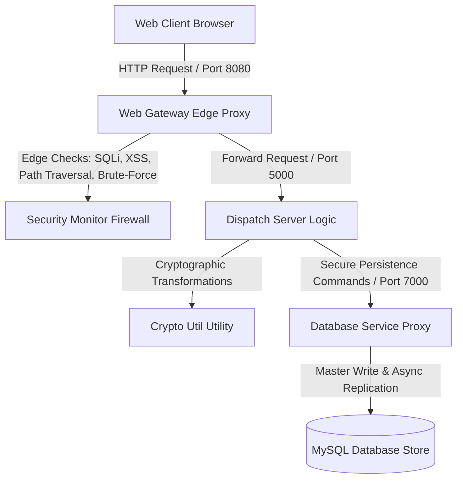

# Distributed Ride-Sharing System: Software Security & Cryptographic Architecture Document

## 1. Executive Summary & Microservices Boundary Design
This document details the formal security architecture and cryptographic specifications implemented within the Distributed Ride-Sharing System. The application is built using a decoupled microservices paradigm designed to isolate state persistence layers from direct public network exposure. Every incoming client payload must traverse a multi-layered boundary structure consisting of a Web Application Firewall (WAF), a local Intrusion Detection System (IDS), and specialized cryptographic processors.

The system is split into four discrete microservices running on isolated local loop ports:
* **Web Gateway (Edge Proxy and WAF)**: Listens on port `8080`. It serves as the primary boundary layer, receiving all incoming client HTTP requests, serving static assets canonicalized within the host root, and running perimeter threat signature sweeps.
* **Dispatch Server (Core Business Logic)**: Listens on port `5000`. It processes authenticated session payloads, manages scheduling constraints, and performs transactional operations.
* **Driver Service (Telemetry and Tracking)**: Listens on port `6000`. It aggregates driver coordinates, processing real-time driver state transitions.
* **Database Service (Persistence Proxy)**: Listens on port `7000`. It operates as the exclusive interface to the MySQL database, executing query writes using an asynchronous master-follower replication engine.



---

## 2. Cryptographic Architecture (`CryptoUtil.java`)
All secure transactions, user authentications, and sensitive data attributes undergo cryptographic transformations prior to persistence. The system utilizes `java.security.MessageDigest` and `javax.crypto.Cipher` APIs to implement these controls.

### 2.1 One-Way Salted Password Hashing (SHA-256)
User passwords are protected against compromise using salted hashing. Plaintext credentials are never written to disk or compared in the clear. 

1. **Entropy Generation**: When a user registers a new account, a cryptographically secure 128-bit random salt is generated utilizing `java.security.SecureRandom`. This ensures that every user possesses a completely distinct salt value regardless of credentials.
2. **Digest Computation**: The plaintext password is concatenated with the hexadecimal representation of the salt. The combined string is then digested using the **SHA-256** message digest algorithm.
3. **Database Schema Storage**: The resulting hash and salt are stored in the `password_hash` column of the `users` table as a combined hexadecimal string using a colon delimiter (`salt:hash`), representing a record structure such as:
   `2066fca618539b4f3981a5c56553564e:f9d2ca66c08fbf563a9ed34abd557266dcd74f5a2cf838392e09acac1cb5ef98`

This architecture prevents precomputed dictionary attacks and rainbow table lookups. Even in the event of an entire database leakage, an attacker cannot identify users sharing identical passwords.

```java
public static String hashPassword(String password, String salt) {
    if (password == null) return null;
    try {
        MessageDigest digest = MessageDigest.getInstance("SHA-256");
        String combined = password + salt;
        byte[] hash = digest.digest(combined.getBytes(StandardCharsets.UTF_8));
        return bytesToHex(hash);
    } catch (Exception e) {
        return password; 
    }
}
```

### 2.2 Reversible Column-Level Symmetric Encryption (AES-256-CBC)
Personally Identifiable Information (PII) must be protected at rest to satisfy strict confidentiality guidelines. The system implements column-level symmetric encryption for sensitive fields, specifically the `email` column in the `users` table and the `license_plate` column in the `drivers` table.

1. **Algorithm Specification**: The encryption engine utilizes **AES** (Advanced Encryption Standard) in **Cipher Block Chaining (CBC)** mode combined with standard **PKCS5Padding** to manage block boundary sizes securely.
2. **Key and Initialization Vector Derivation**: The system derives its 256-bit secret key from a master key seed using a SHA-256 digest. The 16-byte initialization vector (IV) is derived from the first 16 bytes of that key digest.
3. **Persistence Format**: Encrypted records are written to the database with a static prefix (`AES256:`) followed by the Base64 encoded ciphertext. For example, a driver's license plate will appear in the database as:
   `AES256:v6XmY9qB5zT1...`
4. **Decryption Scope**: Decryption only occurs in-memory at the `DispatchServer` layer when responding to verified, authenticated administrative queries. 

```java
public static String encryptAES(String plainText) {
    if (plainText == null || plainText.isEmpty()) return plainText;
    try {
        Cipher cipher = Cipher.getInstance("AES/CBC/PKCS5Padding");
        cipher.init(Cipher.ENCRYPT_MODE, secretKeySpec, ivParameterSpec);
        byte[] encryptedBytes = cipher.doFinal(plainText.getBytes(StandardCharsets.UTF_8));
        return "AES256:" + Base64.getEncoder().encodeToString(encryptedBytes);
    } catch (Exception e) {
        return plainText; 
    }
}
```

---

## 3. Web Application Firewall (WAF) & Intrusion Detection System (IDS)
Perimeter checking is executed by the `com.rideshare.security.SecurityMonitor` engine embedded directly in the Web Gateway request pipeline.

### 3.1 SQL Injection (SQLi) Prevention Shield
All inbound request parameters and raw JSON payloads are inspected against regular expression signature arrays. This regex evaluates query structures for signature SQLi threat indicators:
* Dynamic tautologies (e.g. `' OR '1'='1`)
* Inline comment terminations (e.g. `--`, `#`, or `/*`)
* Data modification keywords (e.g. `UNION SELECT`, `INSERT INTO`, `DROP TABLE`)

If a payload matches any entry in the SQLi regex array, the request is immediately dropped by the Web Gateway, returning an HTTP `403 Forbidden` response to the client.

### 3.2 Cross-Site Scripting (XSS) Prevention Shield
The system guards against script injection vulnerabilities by running active scans on string parameters. Payloads are checked for standard HTML script tags, the `javascript:` protocol syntax, and active event handlers (such as `onload=`, `onerror=`, or `onclick=`). Attempts to inject tags cause the firewall to intercept the request and return an HTTP `403 Forbidden` block message.

### 3.3 Intrusion Detection System Logging
When the WAF intercepts a threat payload, it calls the IDS handler. The incident is logged locally to standard error and dispatched securely via a non-blocking internal database call to the `audit_logs` table:
* **Log Fields**: Event Type, Details, and Time stamp.
* **Log injection Protection**: To prevent attackers from injecting SQL queries through raw threat logs, the logging system applies a custom SQL escape sequence (`escapeSql()`), which isolates single-quote delimiters to render log strings safe.

```java
public static void logSecurityEvent(NetworkClient dbClient, String eventType, String details) {
    System.err.println("[SECURITY-IDS] Alert! Type: " + eventType + " | Details: " + details);
    if (dbClient == null) return;
    try {
        String safeDetails = escapeSql(details);
        String sql = String.format("INSERT INTO audit_logs (event_type, details) VALUES ('%s', '%s')", 
            eventType, safeDetails);
        dbClient.send(new JSONObject().put("type", "DB_UPDATE").put("sql", sql));
        dbClient.receive();
    } catch (Exception e) {
        System.err.println("[SECURITY-IDS] Failed to write log: " + e.getMessage());
    }
}
```

---

## 4. Authentication, Brute-Force Shields & Path Traversal Protections

### 4.1 Secure Session Tokenization
Authentication states are maintained using secure, randomly generated UUID session keys. When a user authenticates successfully, the Web Gateway creates a UUID string (`UUID.randomUUID().toString()`). Every sub-request issued by a client web application must contain a valid `X-Session-ID` header. The Web Gateway intercepts all incoming requests to endpoints (like `/api/request` or `/api/send`) and drops any transactions containing invalid session identifiers.

### 4.2 Dynamic Brute-Force Lockout
To safeguard authentication endpoints from automated brute-force attacks and dictionary matching, the system maintains an in-memory counter using a thread-safe `ConcurrentHashMap`.
1. **Failure Cache**: Every unsuccessful login attempt increments a counter linked to the target username.
2. **Lockout Trigger**: Upon reaching **5 consecutive failed attempts** (`MAX_FAILED_ATTEMPTS = 5`), the system locks the account at the gateway level.
3. **Response Action**: Locked authentication attempts immediately receive an HTTP `429 Too Many Requests` code. An audit alert of type `BRUTE_FORCE_ALERT` is saved to the log database.
4. **Counter Reset**: The failure count for a username is completely cleared upon a successful login.

### 4.3 Directory Traversal Protection (CWE-22)
The Web Gateway features a static file server to deliver HTML, CSS, and JavaScript assets to browsers. To prevent directory traversal exploits, all file requests are validated against the canonicalized path of the system's root folder:
```java
File baseDir = new File("web").getCanonicalFile();
File file = new File(baseDir, path.substring(1)).getCanonicalFile();

if (!file.getPath().startsWith(baseDir.getPath())) {
    String response = "403 Forbidden: Directory traversal attempt detected.";
    t.sendResponseHeaders(403, response.length());
    return;
}
```
This forces the gateway to resolve canonical files, preventing attackers from escaping the boundaries of the root folder (e.g. using `../../` escape sequences).

---

## 5. Security Operations Center (SOC) Sandbox & Controls
The system implements a Security Operations Center (SOC) dashboard within the Administrator Panel (`pages/admin.html`) to facilitate runtime analysis, threat simulation, and auditing.

### 5.1 Dynamic Runtime Toggles
Administrators can adjust system-wide defensive postures in real-time by toggling three main security settings. This updates dynamic flags inside the `WebGateway` without requiring service restarts:
* **Web Application Firewall (`SQL_FILTER_ENABLED`)**: Toggles regex checking on payloads.
* **Brute-Force Shield (`BRUTE_FORCE_PROTECTION`)**: Toggles counter-based lockout.
* **Database Encryption (`ENCRYPTION_ENABLED`)**: Toggles AES column encryption for new writes.

Any state changes dynamically write a `CONFIG_CHANGE` log to the persistent audit database.

### 5.2 Vulnerability Penetration Sandbox
To evaluate defensive postures under load, the panel includes a penetration testing sandbox. This tool simulates three categories of attack payloads:
1. **SQL Injection Attack Simulation**: Executes a login request targeting the `/api/login` endpoint using an `' OR '1'='1` payload.
2. **XSS Script Injection Simulation**: Submits a user registration payload containing `<script>alert(1)</script>`.
3. **Brute Force Spray Simulation**: Fires 5 consecutive invalid authentication requests against an account to trigger dynamic lockout.

The sandbox captures and displays the raw HTTP headers, returned status codes, and active WAF Mitigation block reports, proving defensive coverage under simulated attack vectors.
